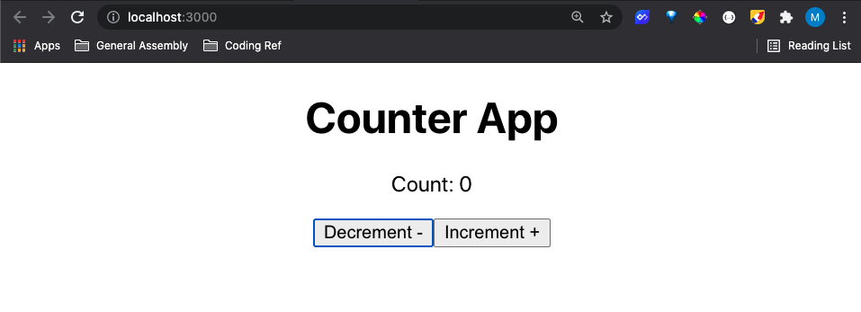
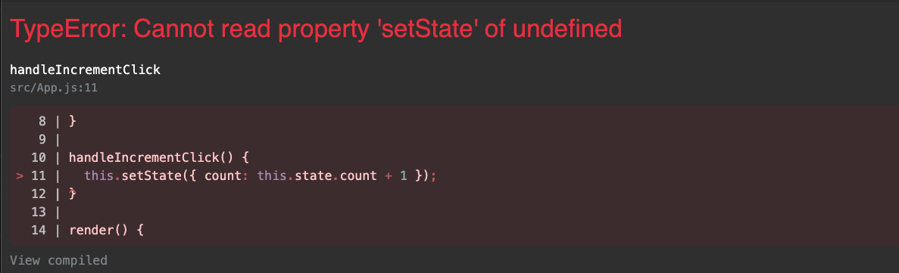

# React State

<!-- 
 -->
<br>

## Learning Objectives

- Learn what state is used for in React
- Learn how to set up state for a component
- Learn how to manage the state of a component
- Listen for DOM Events in React

<br>


<br>

---
## What is State

State is a concept we are actually already familiar with.

You may hear someone refer to "the state of the country" or the "state of affairs". Or perhaps the "state of my bedroom". Any of these things could be in many different states. If we were to describe the state of a bedroom we could say that the bedroom is clean or the bedroom is messy. The key is that the bedroom will not stay in one particular state and will change over time.

### State in React

**_We use state in our React components to handle information that will change over time._**

State is simply a JavaScript object for storing this information.

If we think about a dropdown navigation on a website, we know that sometimes the dropdown navigation will be open, and sometimes it will be closed. The important thing is that this will change over time. For this reason we want to store this information in state.

It may look something like this, indicating that the navigation is open.

```js
state = {
  navIsOpen: true
}
```

If we think about an input field for a form, the input could be empty, or it could have text typed into it. But we do know that the value will change, so we want to use state to keep track of that value.

It might look something like this.

```js
state = {
  inputValue: 'type text in here...'
}
```

The best way to really understand this concept is to build a React app that uses state. Let's get started.

<br>

---
## Code Along: Build a Counter App


To illustrate how state works in React we will be building a simple counter app that will look like this.



The app will allow us to increase or decrease a number by clicking buttons. If we click "Decrement" we want to see the count go down. If we click "Increment" we want to see the count go up.

Take a moment to think about what information in our app will change over time. And what values will we want to store in our state object.

<br>

---
## Set Up

Let's start by setting up a React app with the command line tool, Create React App.

```bash
npx create-react-app counter-app
```

Now we can start the server and view our application at `localhost:3000`
```bash
npm start
```

<br/>

---

<br/>

We'll start by removing the boilerplate code in `App.js` and replace it with our own code. `App.js` should look something like this, although feel free to make it your own.

```js
import './App.css';

function App() {
  return (
    <div className="App">
      <h1>React Counter</h1>
    </div>
  );
}

export default App;
```

We should now see our changes automatically update in the browser. _The Create React App server can be buggy, and from time to time you may have to manually refresh the browser to see your changes._

<br/>

---
## Class Components

So far we have been defining all of our components as functions. These functions take in **props** as parameters and return **JSX**.

Another way to define a component is using a JavaScript **class**. Using a class will allow us add **state** to our component.

We'll start by importing the **React** library into `App.js` at the top of the file.

```js
import React from 'react';
```

We'll now convert our **functional component** into a **classed-based component**. It will look something like this. Let's type it out and then we'll talk about what is going on.

```js
import React from 'react';
import './App.css';

class App extends React.Component {

  render() {
    return (
      <div className="App">
        <h1>React Counter</h1>
      </div>
    );
  }

}

export default App;
```

Here are the changes we've made.

- We've replaced the `function` keyword with the `class` keyword followed by the name of our component. In this example we defined an `App` class that extends `React.Component` and in doing so we just defined an App component.
- We've added a `render` method to our class and include our return statement inside of the `render` method.
- Double check all of your parentheses and curly braces and make sure they are in the right place.

The `render` method of our class is a special method that will be called when the component is rendered. It simply returns **JSX** and _renders_ it to the page.

Save your file and in the browser, if all goes well, you'll see your App component rendering to the page exactly as before. Of course if you are new to this, you'll probably have syntax errors. Totally understandable! Read those error messages and double check your syntax :)

<br/>

---
## Add the UI Elements

Now we'll go ahead and add the UI elements to make our app interactive. Let's add the count and the two buttons into the return statement of the `render` method.

It will look like this.

```js
import React from 'react';
import './App.css';

class App extends React.Component {

  render() {
    return (
      <div className="App">
        <h1>React Counter</h1>

        <p>Count: 0</p>

        <button>Decrement -</button>
        
        <button>Increment +</button>
      </div>
    );
  }
}

export default App;
```

Save the file, and we should see our UI updates in the browser!

The buttons wont do anything yet, but we get a sense of what our app is supposed to do. If we click the "Decrement" button, we want to see the count decrease by 1 on the page. If we click the "Increment" button, we want to see the count increase by 1 on the page.

<br>

---
## Adding State


We know that the count will change over time. For this reason we want to store this value in state.

To add state to our component, we'll add an instance property to our class called `state` and we'll set `state` to an object. It will look like this.

```js
...

class App extends React.Component {

  state = {}

  render() {
    return (
      <div className="App">
        <h1>React Counter</h1>

        <p>Count: 0</p>

        <button>Decrement -</button>
        
        <button>Increment +</button>
      </div>
    );
  }
}

...
```

React is expecting this property to specifically be called `state` and we aren't allowed to use another variable name in this case.

<br>

---
## Storing Values in State

Now let's store the count in state. Create a property in the state object called count and set it's value to zero.

```js
...

class App extends React.Component {

  state = {
    count: 0
  }

  render() {
    return (
      <div className="App">
        <h1>React Counter</h1>

        <p>Count: 0</p>

        <button>Decrement -</button>
        
        <button>Increment +</button>
      </div>
    );
  }
}

...
```

State is simply an object that stores all of the information about our component that we know will change over time.

<br>

---
## Referencing State

At the moment, our count in our `<p>` tag in **JSX** is hard-coded to zero. It doesn't yet have to ability to change. Instead of hard-coding a value we'll reference the count property from state.

In our **JSX**, we'll change `Count: 0` to `Count: {this.state.count}`.

```js
...

class App extends React.Component {

  state = {
    count: 0
  }

  render() {
    return (
      <div className="App">
        <h1>React Counter</h1>

        <p>Count: {this.state.count}</p>

        <button>Decrement -</button>
        
        <button>Increment +</button>
      </div>
    );
  }
}

...
```

Anytime we want to insert JavaScript into **JSX** we'll use the curly brace syntax `{}` and insert our JavaScript inbetween the two tags.

In this case, we're referencing the `count` property in our `state` object with `this.state.count`.

Take a look at our change in the browser. We should still see "Count: 0" showing on the page. Now update the value of the count in state to 1.
```js
state = {
  count: 1
}
```
And view the change in the browser.

Change the value of count again and watch the UI automatically change.

**Note:** _The idea here is, when we want something to change on the page we update state and then React will automatically update our UI for us._

Continue playing around with this by changing the value in state and watching the value change automatically in the browser.

<br>

---
### Why Do We Use "this"

We use a class as a blueprint to create many instances of a certain type of object. For example, we could have a Person class to create many Person objects. `this` refers to the instance of the class. When App is rendered we're creating an instance of the `App` class. Anytime we want to access properties on that instance we'll use the `this` keyword. We will be adding other properties and methods to our classes and we always use the `this` keyword to access them. Feel free to review our previous lesson on JavaScript classes and our use of the `this` keyword to access properties and methods.

If this doesn't quite gel yet, no worries. Often times it takes a while of using React classes before this fully starts to gel.

<br>

---
## Listening for a Button Click

We can see how we are able to change the value in the UI by manually changing the value stored in state.

However, we want the user to be able to click the "Increment" button and have that automatically increase the count value in state by 1. We want to user to be able to click the "Decrement" button and have that automatically decrease the count value in state by 1.

We'll add an event listener to the "Increment" button that listens for a click.

Add an `onClick` attribute to the "Increment" button.

```js
...

<button onClick={}>Increment +</button>

...
```

This event listener will listen for whenever this button is clicked and then call the function passed to it. We haven't passed it a function yet, so let's do that.

Pass the function `() => console.log('button clicked')` inside the curly braces.
```js
...

<button onClick={() => console.log('button clicked')}>Increment +</button>

...
```

Whenever our button is clicked we will call the arrow function we passed which simply logs 'button clicked' to the console.

Back in your browser, open the dev console, and click the "Increment" button.

You should see your log message appear on click!

<br>

---
## Passing a Handler Function

Our goal is to update the count in state when the button is clicked. We'll often create a separate handler function to take care of this logic.

Create a method called `handleIncrementClick` in the `App` component and have it log out 'button clicked!!!'.

```js
...

class App extends React.Component {

  state = {
    count: 0
  }

  handleIncrementClick() {
    console.log('button clicked!!!');
  }

  render() {
    return (
      <div className="App">
        <h1>React Counter</h1>

        <p>Count: {this.state.count}</p>

        <button>Decrement -</button>
        
        <button onClick={() => console.log('button clicked')}>Increment +</button>
      </div>
    );
  }
}

...
```

<br>

---
## Pass in Click Handler

We'll then pass the `handleIncrementClick` method to the `onClick` event listener for our button.

```js
...

class App extends React.Component {

  state = {
    count: 0
  }

  handleIncrementClick() {
    console.log('button clicked!!!');
  }

  render() {
    return (
      <div className="App">
        <h1>React Counter</h1>

        <p>Count: {this.state.count}</p>

        <button>Decrement -</button>
        
        <button onClick={this.handleIncrementClick}>Increment +</button>
      </div>
    );
  }
}

...
```

Notice that we reference the `handleIncrementClick` method with `this.handleIncrementClick`. Whenever referencing a method in our class we will do so with the `this` keyword.

Now When the button is clicked, `handleIncrementClick` will be called, which then calls our `console.log` logging our message to the console.

<br>

---
## Calling setState

We want our handler method to update the value of `count` in state. React gives us a handy method to call anytime we want to update our component's state called `setState`.

Inside the `handleIncrementClick` function we'll call `this.setState()`.

```js
...

handleIncrementClick() {
  this.setState();
}

...
```

Save your file and test this out by now clicking the "Increment" button.

...

Uh oh! We should now get an error.



Not to worry. This error is very common and we will see it a lot. `Cannot read property 'setState' of undefined` means that the `this` keyword is undefined. Because `handleIncrementClick` is being triggered by a DOM event (our click event) the `this` keyword gets lost. We'll convert `handleIncrementClick` to an arrow function, which will set the `this` keyword back to the component instance just how we want it.

```js
...

handleIncrementClick = () => {
  this.setState();
}

...
```

And now we should be error free!

<br/>

---
## Updating State with setState

When calling the `setState()` method, we'll pass it an object specifying the properties in state we want to update and the values we want to set them to.


We'll pass `{ count: this.state.count + 1 }` into our `setState()` function call like so.

```js
...

handleIncrementClick = () => {
  this.setState({ count: this.state.count + 1 });
}

...
```
This will update the value of `count` in state to one more than it was before.

Save the file and test it out in your browser. If all goes well, when clicking the "Increment" button we should see the count increase by one!

<br>

---
## React Flow

What is going on here?

With React, any time we want to change imformation on the page, we update state by calling the `setState` method. And anytime we call the `stateState` method, the values in state will be updated _and then the component's `render` method will be called_. And because the **JSX** in the `render` method references state with `this.state.count` the value on the page will be updated.

We can trace this flow in our own Counter App. See if you can follow along in your own code.

1. When the page loads in the browser, the component's **JSX** will render. Inside of our `render` method we are referencing `this.state.count` and will pull in the initial value of the `count` which is zero. At this point the app is not doing anything, just patiently waiting for someone to click on the "Increment" button.

2. When a user clicks the "Increment" button, the click event will trigger the `handleIncrementClick` method.

3. The `handleIncrementClick` method will call the `setState` method passing in the updated value for `count` in state. We want to set `count` to one more than it was before by passing in `{ count: this.state.count + 1 }`.

4. Calling `setState` will update `count` in state.

5. After updating our state the `render` method will be called again. This time it will pull in the new value for `this.state.count` and render the new value on the page.

6. At this point, we are back to the beginning. The app is not doing anything and just patiently waiting. When a user clicks on the "Increment" button the whole process will be kicked off again.

**Take your time reviewing this flow again before moving on.** The concepts are challenging at first, but if you take the time now to understand it, it will help out a lot later as we build on these concepts.

<br>

---
## Drecrement the Count on Click

At this point we can increment our count by clicking the "Increment" button. Let's see if we can get that "Decrement" button to work. The code to get the "Decrement" button to work will look almost exactly the same as the code we wrote for "Increment" with one small change. This time when clicking "Decrement" we want to decrease the value of the `count` by 1.

Start by creating a `handleDecrementClick` method in your `App` component.

Try it out and see how far you can get before taking a look at the solution code!

<details>
  <summary>Solution Code:</summary>

  ```js
  import React from 'react';
  import './App.css';

  class App extends React.Component {

    state = {
      count: 0
    }

    handleIncrementClick = () => {
      this.setState({ count: this.state.count + 1 });
    }

    handleDecrementClick = () => {
      this.setState({ count: this.state.count - 1 });
    }

    render() {
      return (
        <div className="App">
          <h1>React Counter</h1>

          <p>Count: {this.state.count}</p>

          <button onClick={this.handleDecrementClick}>Decrement -</button>
          
          <button onClick={this.handleIncrementClick}>Increment +</button>
        </div>
      );
    }
  }

  export default App;
  ```
</details>

And there you have it folks! We can now increment _and_ decrement our count on the page all by using React state.

<br>

---
# Add a Feature

Add a feature where the count cannot go below 0. How could we implement that? What part of the code would we make some additions to?

<details>
  <summary>Hint:</summary>
  
  You'll only want to decrease the count in state _if_ a particular condition is true.
</details>

<details>
  <summary>Solution:</summary>
  
  ```js
  Inside the `handleDecrementClick` function we can do an if check first before updating state.
  
  ...
  handleDecrementClick = () => {
    if (this.state.count > 0) {
      this.setState({ count: this.state.count - 1 });
    }
  }
  ...
  ```
</details>

Takes some time again to review the flow of information in your code.

1. When the page loads in the browser, the component's **JSX** will render. Inside of our `render` method we are referencing `this.state.count` and will pull in the initial value of the `count` which is zero. At this point the app is not doing anything, just patiently waiting for someone to click on the "Decrement" button.

2. When a user clicks the "Decrement" button, the click event will trigger the `handleDecrementClick` method.

3. The `handleDecrementClick` method will call the `setState` method passing in the updated value for `count` in state. We want to set `count` to one less than it was before by passing in `{ count: this.state.count - 1 }`.

4. Calling `setState` will update `count` in state.

5. After updating our state the `render` method will be called again. This time it will pull in the new value for `this.state.count` and render the new value on the page.

6. At this point, we are back to the beginning. The app is not doing anything and just patiently waiting. When a user clicks on the "Decrement" or "Increment" button the whole process will be kicked off again.

Again these concepts are challenging at first and most likely very new to you. **Take some time to review this flow with your own code. To help solidify these concepts more rebuild the Counter App from the begining. You will likely find you pick up more the second or third time around.**

Happy Reacting!

<br>

---
# Additional Resources

Head on over to the React Documentation for some excellent learning material and additional practice.

React Documentation<br>
https://reactjs.org/

React Tic-Tac-Toe Tutorial<br>
https://reactjs.org/tutorial/tutorial.html#setup-option-2-local-development-environment
